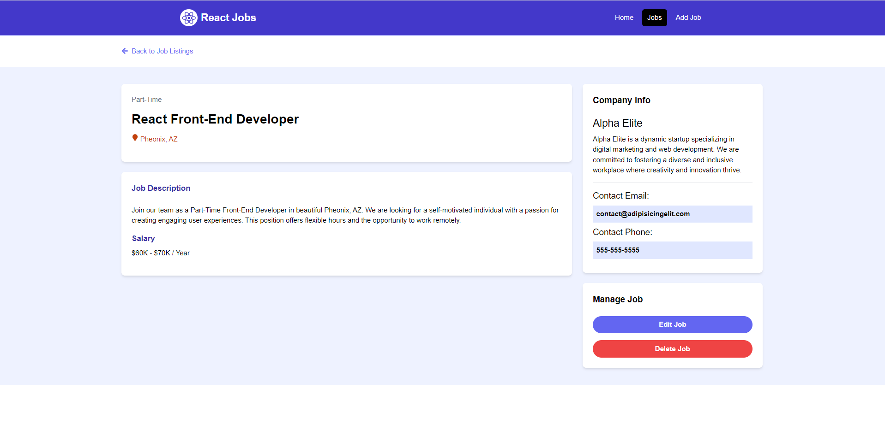

# React Jobs Project

This is the jobs listing project where you can browse multiple jobs.

## Setup 

- Install react app using vite 
```js
npm create vite@latest
```
- Install and init tailwind css

```js
npm install -D tailwindcss
npx tailwindcss init
```

- Configure tailwind css in your project

  `npx tailwindcss init` command will create a file `tailwind.config.js` in your project's root directory.
  Open `tailwind.config.js` and replace all content with below code.

```js
/** @type {import('tailwindcss').Config} */
module.exports = {
  content: ["./src/**/*.{js,jsx,ts,tsx}"],
  theme: {
    extend: {},
  },
  plugins: [],
};
```
- Add the @tailwind directives for each of Tailwind’s layers to your ./src/index.css file.

```css
@tailwind base;
@tailwind components;
@tailwind utilities;
```

### Install Dependencies

```bash
npm install
```

### Run JSON Server

The server will run on http://localhost:8000

```bash
npm run server
```

### Run Vite Frontend

React will run on http://localhost:3000

```bash
npm run dev
```
### Backend

This project uses JSON-Server for a mock backend.

## Screen Shot

- Home Page


- Job Description 



- Browse Page


- Add Job Page

